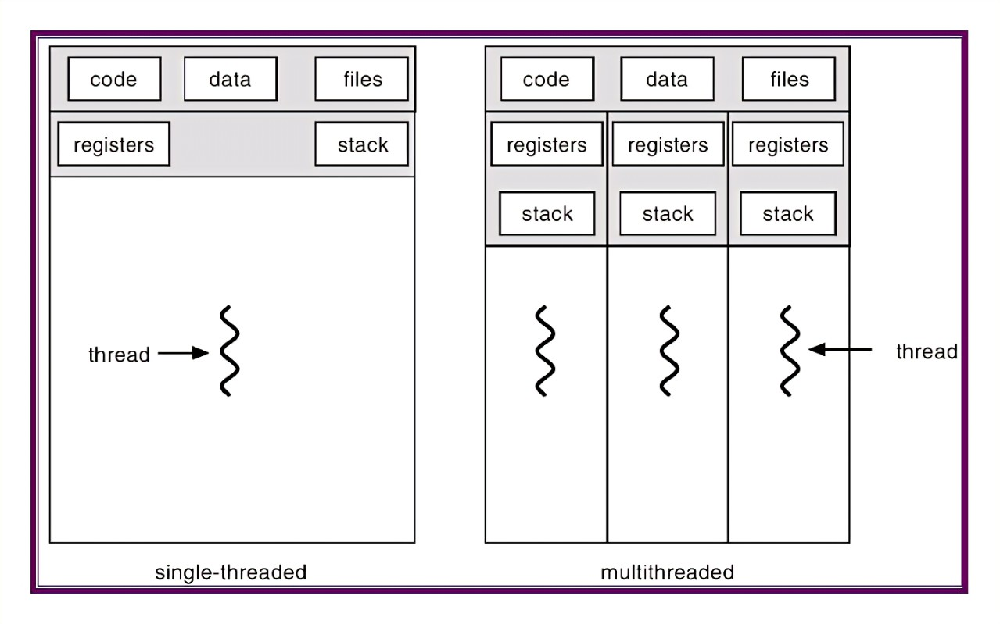

# Thread Pool Cpp

项目来源：<https://github.com/progschj/ThreadPool>

项目简介：一个利用c++11标准，全平台通用的线程池简单实现

使用方法：作者将线程池封装为ThreadPool类，包含于头文件中；由于只是用c++11标准库内容，因此不需要链接任何第三方库

下面是对该项目的个人浅析：

## 线程池最基本的工作原理

> 本项目只包含最简单的多线程并发，不涉及异步计时器等内容

<!--  -->
<!--  -->


### 什么是多线程

我们知道，在我们运行C/C++程序（或称为一个 **进程** ）时，程序一行一行地执行我们写下的代码；这是一种顺序结构，或者说，这是一种线性结构

显然，这样的程序意味着：我们在同一时刻只能运行一条语句；下一条语句总是在上一条语句结束之后才能发生

有时我们又希望程序在同一时刻完成多个任务。比如说：对于一个高性能的网络服务器，他肯定不能一个一个地处理客户端的请求：这样第1M个客户端的请求该等到猴年马月才能被接收。。。

面对这种情况，一个有效的解决方式就是将服务器调整为 **非线性结构** ；或者简单一点说，将服务器程序变成 **多条线性的结构**

<!--  -->
<!--  -->


对于多条线性的结构的程序——多线程的程序，我们可以想象每一个线程都有各自的起点和终点，他们共享同样的数据但是各自同时对数据进行独自的加工

对于C++来说，线程就像是一条生产线：当我们配置好生产线的设备，确定好生产线的任务，并提供给这条生产线他所需要的原材料之后，就可以让他开始工作了！

`std::thread t(Fn&& fn, Args... args)`这条语句就创建了一个线程的实例t：
他以参数fn为设备（任务），以（可变）参数args为原材料，生产出主线程想要的“产品”

### 为什么需要线程池

按照我们之前的思路，只要我们对于每一个需要并行处理的任务，都为他创建一个线程去处理不就好了吗？为什么非得要把几个线程放到一起处理所有的请求呢？

首先，创建和销毁线程的实例需要耗费大量的CPU时间

> 试想一下，倘使我们程序的大部分时间都放在了创建和销毁线程的事情上，那么还会有什么时间办正事呢？
>
> 同时，当线程过多时，CPU在不同线程之间来回切换的时间也就不可忽略了；这同样造成了资源的浪费

其次，线程池有利于更好地进行任务调度

> 什么是任务调度呢？我们浅显理解一下：对于每一个需要并行处理的任务，可能会有 **优先级** 的区别；我们当然需要优先处理优先级更高的任务。这种需求线程池就可以轻松办到

还有，线程池可以让你的程序具有良好的鲁棒性

> 通过封装线程池，我们可以写出RAII的代码，从而减少出现 **创建了线程却没有销毁的内存泄露** 问题

单挑以上任何一点，都足以成为我们学习线程池的动机

既然如此，让我们开始学习C++的线程池吧！

## 线程池的简单实现

开源项目 <https://github.com/progschj/ThreadPool> 利用C++11写出了一个精巧易懂的线程池实现，并具有良好的扩展性，成为我们学习的基础

源码如下（thread_pool.h）：

```cpp
#ifndef THREAD_POOL_H
#define THREAD_POOL_H

#include <condition_variable>
#include <functional>
#include <future>
#include <memory>
#include <mutex>
#include <queue>
#include <stdexcept>
#include <thread>
#include <vector>
```
> 这是引用的头文件，其中condition_variable（条件变量）、future（异步地获取运行结果）、mutex（为了访问共享内存而设置的锁🔒）、thread（包含线程类的文件）

```cpp
class ThreadPool {
public:
  ThreadPool(size_t);
  template <class F, class... Args>
  auto enqueue(F &&f, Args &&...args)
      -> std::future<typename std::result_of<F(Args...)>::type>;
  ~ThreadPool();

private:
  // need to keep track of threads so we can join them
  std::vector<std::thread> workers;
  // the task queue
  std::queue<std::function<void()>> tasks;

  // synchronization
  std::mutex queue_mutex;
  std::condition_variable condition;
  bool stop;
};
```

> 这里定义了线程池的结构：它拥有 **一组线程** ，一个 **任务队列** ，一个 **互斥锁** ，一个“唤醒线程”的 **条件变量** 和条件2

```cpp
// the constructor just launches some amount of workers
inline ThreadPool::ThreadPool(size_t threads) : stop(false) {
  for (size_t i = 0; i < threads; ++i)
    workers.emplace_back([this] {
      for (;;) {
        std::function<void()> task;

        {
          std::unique_lock<std::mutex> lock(this->queue_mutex);
          this->condition.wait(
              lock, [this] { return this->stop || !this->tasks.empty(); });
          if (this->stop && this->tasks.empty())
            return;
          task = std::move(this->tasks.front());
          this->tasks.pop();
        }

        task();
      }
    });
}
```

> 这是线程池的构造函数，调用它我们就可以创建一个线程池的实例
>
> 通过传入的参数threads，我们可以限制线程的总数；在互斥锁的保护下，某条线程从任务队列中取出任务，并执行之

```cpp
// add new work item to the pool
template <class F, class... Args>
auto ThreadPool::enqueue(F &&f, Args &&...args)
    -> std::future<typename std::result_of<F(Args...)>::type> {
  using return_type = typename std::result_of<F(Args...)>::type;

  auto task = std::make_shared<std::packaged_task<return_type()>>(
      std::bind(std::forward<F>(f), std::forward<Args>(args)...));

  std::future<return_type> res = task->get_future();
  {
    std::unique_lock<std::mutex> lock(queue_mutex);

    // don't allow enqueueing after stopping the pool
    if (stop)
      throw std::runtime_error("enqueue on stopped ThreadPool");

    tasks.emplace([task]() { (*task)(); });
  }
  condition.notify_one();
  return res;
}
```

> 这段代码展示了如何向线程池的任务队列中添加一个新的任务：通过std::packaged_task、std::future、std::forward等晦涩的语法，将任务对象放到队列中等待执行；并通过条件变量通知其他线程“有任务来了！！！”
>
> 此时，其他线程终于结束了等待（condition.wait方法），开始工作

```cpp
// the destructor joins all threads
inline ThreadPool::~ThreadPool() {
  {
    std::unique_lock<std::mutex> lock(queue_mutex);
    stop = true;
  }
  condition.notify_all();
  for (std::thread &worker : workers)
    worker.join();
}

#endif
```

> 线程池的销毁过程：依据RAII思想，Resource Acquisition Is Initialization，当对象的生命周期结束后自动销毁该对象的内存空间
>
> 体现在这里就是将所有子线程join进主线程

至此，一个线程池的基本功能就全部完成了

### 如何使用

项目中附赠了一个简单的示例代码，帮助人们使用线程池

```cpp
#include <chrono>
#include <iostream>
#include <vector>

#include "thread_pool.h"

int main() {

  ThreadPool pool(4);
  std::vector<std::future<int>> results;

  for (int i = 0; i < 8; ++i) {
    results.emplace_back(pool.enqueue([i] {
      std::cout << "hello " << i << std::endl;
      std::this_thread::sleep_for(std::chrono::seconds(1));
      std::cout << "world " << i << std::endl;
      return i * i;
    }));
  }

  for (auto &&result : results)
    std::cout << result.get() << ' ';
  std::cout << std::endl;

  return 0;
}
```

> 在这份示例代码中，作者创建了一个拥有四个线程的线程池，并且向任务队列中拢共放了8个任务


## 后记

- 我们分配多少线程最合适？一般来说，为了充分利用CPU的并发能力，我们线程数应该和CPU核数相当；这样每个CPU核可以单独处理一件任务。（[电脑配置说的几核几线程到底是什么意思？谢谢? - 知乎](https://www.zhihu.com/question/619271380)）
- 如何控制任务的优先级？通过阅读代码我们可以知道，我们使用队列来存储所有任务；那么，如果我们可以定义人物的优先级，那么就可以使用[优先队列](https://oi-wiki.org//lang/csl/container-adapter/#%E4%BC%98%E5%85%88%E9%98%9F%E5%88%97)来进行优化。事实上，许多算法可以通过优先队列进行优化
- 互斥量（mutex）是什么？首先我们知道，所有线程共享进程中的数据，因此在并行过程中，可能出现两个线程同时访问同一个内存地址；若两个内存都只进行读操作还好，可当某个线程进行写操作时，无疑影响了另一个线程的结果。通过加锁，我们可以保证每个时刻至多有一个线程对数据进行操作